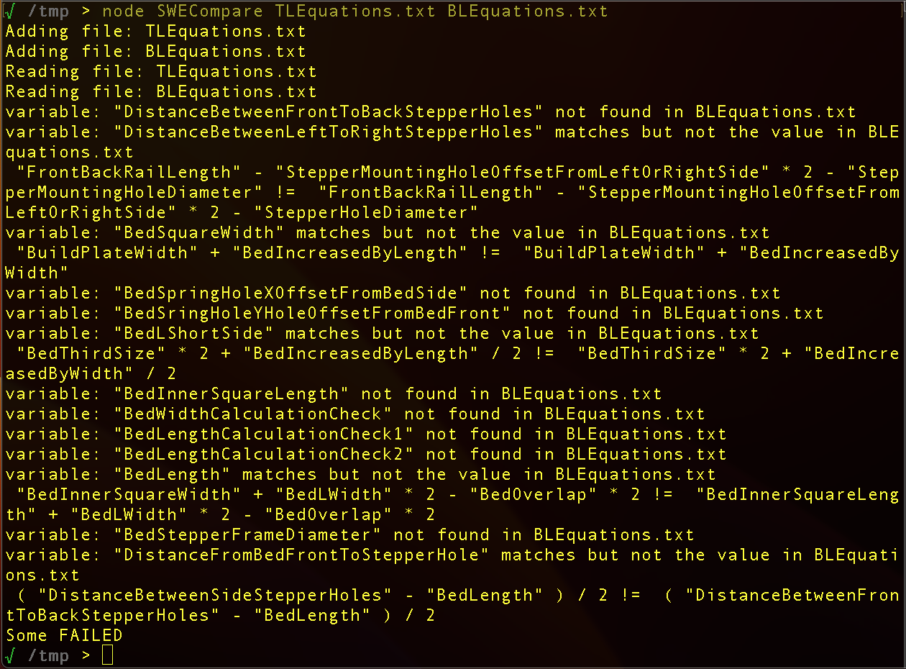

# SWECompare - Solid Works Equation File Comparison Tool.
<base _target="_self">

<BR><BR>
## Table of Contents
* [**About SWECompare**](#about-swecompare)
* [**Screenshots**](#screenshots)
* [**Installation**](#installation)
* [**How to use SWECompare to compare two equation files**](#how-to-use-swecompare-to-compare-two-equation-files)
* [**How to use SWECompare to compare multiple equation files with the first**](#how-to-use-swecompare-to-compare-multiple-equation-files-with-the-first)
* [**How to use SWECompare to find unused variables**](#how-to-use-swecompare-to-find-unused-variables)
* [**How to use SWECompare to find unused variables that may be defined in other files**](#how-to-use-swecompare-to-find-unused-variables-that-may-be-defined-in-other-files)
* [**License**](#license)

<BR><BR>
## About SWECompare
&nbsp;&nbsp;&nbsp; SolidWorks 2023 Maker Version does not allow multiple parts to share a single global variable file. This is more than inconvenient; SWECompare is a node.js tool that tries to resolve this by comparing exported equation files accordingly.<BR>
So why not use diff? Well?<BR>
<UL>
<LI> I needed the ability to ignore missing comments.</LI>
<LI> I needed the ability to audit for unused variables that may be in an equation file or maybe another.</LI>
<LI> Exported files can contain different equations like "d1@Something" which needs to be ignored</LI>
</UL>

<BR><BR>
## Screenshots
<p ALIGN="center">
  
</p>

<BR><BR>
## Installation
&nbsp;&nbsp;&nbsp; SWECompare is a Node.js tool with no other dependancies; So it works as easily on Linux as it does on Windows. The only thing you must do is install node.js.<BR>

<UL>
<LI> Install Node.js
<LI> For Node.js to recognized in your PATH, open a new terminal window.
<LI> Run SWECompare. i.e. node SWECompare -h
</UL>

<BR><BR>
## How to use SWECompare to compare two equation files
&nbsp;&nbsp;&nbsp; Run SWECompare specifying both equation files.

<BR>
For Example:
```
   node SWECompare equationsFile1.txt equationsFile2.txt
```
<UL>
</LI>To ignore comments that may be different, specify -ic
</LI>To compare file2 with file1 also specify -r (Valid for two files only)
</UL>

<BR><BR>
## How to use SWECompare to compare multiple equation files with the first
&nbsp;&nbsp;&nbsp; Run SWECompare specifying multiple equation files.

<BR>
For Example:
```
   node SWECompare equationsFile1.txt equationsFile2.txt equationsFile3
```

<BR><BR>
## How to use SWECompare to find unused variables
&nbsp;&nbsp;&nbsp; Run SWECompare specifying a single equations files.

<BR>
For Example:
```
   node SWECompare equationsFile.txt
```

<BR><BR>
## How to use SWECompare to find unused variables that may be defined in other files
&nbsp;&nbsp;&nbsp; Run SWECompare specifying a single equations files.

<BR>
For Example:
```
   node SWECompare -v equationsFile.txt anotherEquationsFile.txt orEvenAnotherEquationsFile.txt
```

<BR><BR>
## License
See [LICENSE](LICENSE)


<!---
Link References (Not Local)
-->

[ztalbot2000]:https://github.com/ztalbot2000
